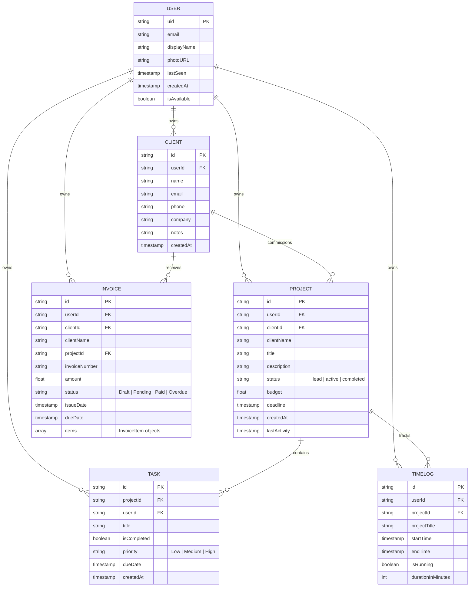

# ClientNest - Cloud Firestore Schema

ClientNest uses a highly scalable NoSQL structured database via Cloud Firestore. To optimize for speed, query efficiency, and strict security rules, the entire database is scoped under a **root hierarchical user structure**.

## Entity Relationship Diagram


## Collection Structure

### 1. `users/{uid}` (Root Collection)
The user document stores authentication and high-level user preferences.
- **Path**: `users/{uid}`
```json
{
  "uid": "abc123xyz890",
  "email": "freelancer@example.com",
  "displayName": "Jane Doe",
  "photoURL": "https://example.com/photo.jpg",
  "lastSeen": "2023-11-20T10:30:00Z",
  "createdAt": "2023-01-15T08:00:00Z",
  "isAvailable": true
}
```

---

### 2. `crm` (Clients Subcollection)
Stores all clients associated with a user.
- **Path**: `users/{uid}/crm/{clientId}`
```json
{
  "userId": "abc123xyz890",
  "name": "Acme Corp",
  "email": "contact@acme.com",
  "phone": "+1-555-0199",
  "company": "Acme Corporation",
  "notes": "Premium enterprise tier client.",
  "createdAt": "2023-10-01T12:00:00Z"
}
```

---

### 3. `nests` (Projects Subcollection)
Stores all projects/workspaces ("nests").
- **Path**: `users/{uid}/nests/{projectId}`
```json
{
  "userId": "abc123xyz890",
  "clientId": "client_987",
  "clientName": "Acme Corp",
  "title": "Q4 Marketing Website",
  "description": "Complete redesign of the main landing page.",
  "status": "active",
  "budget": 5500.00,
  "deadline": "2023-12-15T23:59:59Z",
  "createdAt": "2023-11-01T09:00:00Z",
  "lastActivity": "2023-11-20T10:00:00Z"
}
```

---

### 4. `tasks` (Tasks Subcollection)
Stores individual tasks. Linked to projects via `projectId`.
- **Path**: `users/{uid}/tasks/{taskId}`
```json
{
  "userId": "abc123xyz890",
  "projectId": "project_456",
  "title": "Design hero section mockup",
  "isCompleted": false,
  "priority": "High",
  "dueDate": "2023-11-25T17:00:00Z",
  "createdAt": "2023-11-10T14:30:00Z"
}
```

---

### 5. `finance` (Invoices Subcollection)
Stores financial invoices. Items are embedded inside the document.
- **Path**: `users/{uid}/finance/{invoiceId}`
```json
{
  "userId": "abc123xyz890",
  "clientId": "client_987",
  "clientName": "Acme Corp",
  "projectId": "project_456",
  "invoiceNumber": "INV-2023-042",
  "amount": 2500.00,
  "status": "Pending",
  "issueDate": "2023-11-15T00:00:00Z",
  "dueDate": "2023-11-30T00:00:00Z",
  "items": [
    {
      "description": "UI/UX Design Phase 1",
      "quantity": 1,
      "unitPrice": 2500.00
    }
  ]
}
```

---

### 6. `timelogs` (Time Tracking Subcollection)
Stores time tracking logs for active work sessions.
- **Path**: `users/{uid}/timelogs/{timeLogId}`
```json
{
  "userId": "abc123xyz890",
  "projectId": "project_456",
  "projectTitle": "Q4 Marketing Website",
  "startTime": "2023-11-20T13:00:00Z",
  "endTime": "2023-11-20T15:30:00Z",
  "isRunning": false,
  "durationInMinutes": 150
}
```
